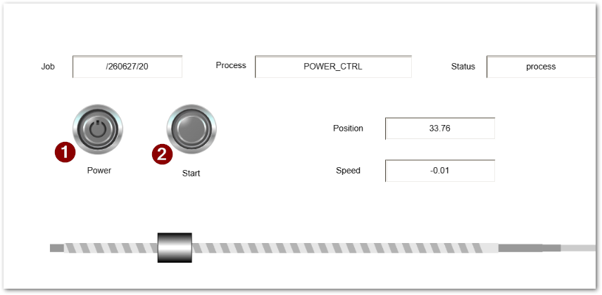

# TwinCAT + PyADS + Apache IoTDB + Grafanaによるコンテナアプリケーション

このリポジトリは、TwinCATのIoT向けプロトコルとして開発された ADS-over-MQTT を使い、工場などに置かれたBeckhoff製 IPC から稼働中の制御データを時系列データベースに保存し、Grafana上に表示する実装サンプルです。次図の上部のコンテナ群をdocker-composeで構築します。


> [!note]
> 本システムは、PythonがADS通信を行うためのパッケージpyadsを使用してTwinCATと接続します。この際、ads-over-mqttを通じて通信を行うために、pyadsが稼働するコンテナ上にもTwinCATランタイムを動作させています。（図中のTcSystemServiceUm）pyadsは、このプロセスが動作している上で、 TcAdsDll.so をリンクしてads-over-mqttによるADS接続を実現しています。
>
> これらのTwinCAT関連ソフトウェアをインストールするため、コンテナビルド時にTwinCAT RT Linuxのaptリポジトリを登録し、ここからパッケージをダウンロードするためのMyBeckhoffのアカウント設定が事前に必要となります。


> [!important]
> サポートについて
> * 本システムはライセンス条項に基づき、いかなる保証を行いません。
> * Beckhoff製IPCの導入をご検討の上、本システムの活用をご検討されている方には技術的なご相談にお応えいたします。ご遠慮なくお問い合わせください。
> * また第三者企業様が十分に検証を行われた上でサービス、または、製品化していただくことはなんら妨げません。この場合も開発元であるベッコフオートメーション株式会社、および本ソフトウェア作者は一切責任を負いません。

## 動作環境

docker-ce が動作する環境が必要です。クラウドやオンプレミスのさまざまなLinux Distributionだけでなく、Windows上のWSL上でも動作可能です。

ただし、本サンプルではIPCと本システム間の通信に使用するMQTTをセキュアな設定にはしておりませんので、クラウド上での使用には適していません。別途TLSの設定が必要です。

## 設置手順

### 準備

1. [Docker-ceをインストール](https://beckhoff-jp.github.io/TwinCATHowTo/linux/docker/install_docker.html)してください。
2. 本システムを稼働させるコンピュータに GNU make をインストールしてください。debian系のパッケージマネージャを例に次のとおりコマンド発行してインストールします。

    ``` bash
    sudo apt install --yes make
    ```

3. Beckhokffのサイトにて、[MyBeckhoffのアカウントを作成](https://www.beckhoff.com/ja-jp/mybeckhoff-registrierung/index.aspx)してください。
4. サンプルのIPCプロジェクトである[ジョブフレームワーク](https://github.com/Beckhoff-JP/PLC_JobManagementFramework)プロジェクトをIPC等に書き込んで動作できる状態にしておきます。

> [!note]
> EtherCATの実ネットワークであるEL7201やモータが接続されていない場合は、EtherCATを無効化させ、仮想軸をシミュレータモードにしてください。
> Visualization画面から`Power`ボタンを押したあと、`Start`ボタンを押せばシーケンスを連続開始します。
>
> 


### リポジトリの展開と設定

リポジトリをクローンなど行ってターゲットのコンピュータ上に展開し、2か所設定を行います。

1. MyBeckhoffアカウントの設定

    次のファイルを編集し、MyBeckhoffで作成したアカウントのメールアドレスとパスワードを設定します。

    ``` bash
    twincat_data_collector/apt-config/bhf.conf

    machine deb.beckhoff.com login <MyBeckhoffメールアドレス> password <MyBeckhoffパスワード>
    machine deb-mirror.beckhoff.com login <MyBeckhoffメールアドレス> password <MyBeckhoffパスワード>
    ```
   
2. 自分とターゲットIPCのAMS NET IDをそれぞれ `docker-compose.yaml` ファイルに定義します。自分のAMS NET IDは6桁の1～255までの数字の組み合わせでADSネットワーク内で重複が無ければ何でも構いません。迷ったら IPアドレスに `.1.1` を付け加えたものにしておけばよいでしょう。

    ``` yaml
    /docker-compose.yaml
      :
     data_acquisition:
      image: data_acquisition:latest
      container_name: data_acquisition
      restart: unless-stopped
      hostname: data_acquisition
      depends_on:
        iotdb:
          condition: service_healthy
      privileged: true
      environment:
        - ROUTER_ADDRESS=localhost
        - TARGET_AMSID=15.15.15.15.1.1  <-- IPC側のIDをここに定義
        - MY_AMSID=192.168.20.20.1.1  　<-- 自分のIDをここに定義
        - IOTDB_HOST=iotdb
        - PCI_DEVICES=NONE
    ```

### Dockerイメージのビルド

本リポジトリのディレクトリツリー内の次の場所で、`sudo make build-image` コマンドを入力します。

``` bash
cd twincat_data_collector
sudo make build-image
```

パスワードを入力すると、Docker buildが開始されます。ビルドにはインターネット接続が必要です。

> [!tip]
> sudo make build-image コマンドで実行している中身は次のとおりです。これを簡素化するためにmakeコマンドを実行しています。
> 
> ``` bash
>  cd twincat_data_collector
> sudo docker build --secret id=apt,src=./apt-config/bhf.conf --network host -t data_acquisition 。
>  ```


### MQTTブローカへのアクセスポート1883を開放

本システムには、MQTTブローカであるmosquittoサーバが稼働するコンテナが内包されています。このサーバへのアクセスを外部から受け付けられるように、設置するコンピュータのファイヤウォール設定を行います。

ここでは、debian 13 (trixie) で採用されているnftablesを例に説明します。

1. `/etc/nftables.conf.d/` ディレクトリ以下に新規のファイル `60-mosquitto-container.conf` を作成します。

    ``` bash
    sudo touuch /etc/nftables.conf.d/60-mosquitto-container.conf
    ```

2. 作成したファイルをテキストエディタで編集します。（vi や nanoなど）

    ``` conf
    table inet filter {
      chain input {
        tcp dport 1883 accept
      }
      chain forward {
        type filter hook forward priority 0; policy drop;
        tcp sport 1883 accept
        tcp dport 1883 accept
      }
    }
    ```

3. 設定を反映します。

    ```bash
    sudo nft -f /etc/nftables.conf.d/60-mosquitto-container.conf
    ```

4. systemdでも反映します。

    ``` bash
    sudo systemctl restart nftables
    ```


### IPC側の設定

IPC側の設定は極めて簡単です。次のファイルを作成し、次の場所に置きます。


* Windowsの場合（Buuild 4024 まで）

    ``` bash
    C:\TwinCAT\3.1\Target\Routes\mqtt.xml
    ```

* Windowsの場合（Build 4026以後）

    ``` bash
    C:\Program Files(x86)\Beckhoff\TwinCAT\3.1\Target\Routes\mqtt.xml
    ```

* LinuxやTwinCAT BSDの場合

    ``` bash
    /etc/TwinCAT/3.1/Target/Routes/mqtt.xml
    ```

> [!note]
> Targetディレクトリ以下のRoutesディレクトリは存在しないことが多いので新規作成してください。


mqtt.xmlファイルの中身は次の通り定義します。Adressタグの中に、mosquittoコンテナを配置したサーバのIPアドレスを設定してください。

``` xml
<?xml version="1.0" encoding="utf-8"?>
<TcConfig xmlns:xsi="http://www.w3.org/2001/XMLSchema-instance"
xsi:noNamespaceSchemaLocation="http://www.beckhoff.com/schemas/2015/12/TcConfig">
<RemoteConnections>
    <Mqtt>
        <Address Port="1883">ここに本システムが稼働するコンピュータのIPアドレスを設定</Address>
        <Topic>AdsOverMqtt</Topic>
    </Mqtt>
</RemoteConnections>
</TcConfig>

```

## コンテナを起動

> [!important]
> 事前にIPCにジョブフレームワークプロジェクトをActive configurationを行ってRUNさせてください。
> 
> また、本コンテナシステムが稼働しているコンピュータとIPCのEthernetポートと接続し、TCP/IP接続できるようにしておいてください。

本システムを稼働させるコンピュータに展開したリポジトリの最上位である `docker-compose.yaml` ファイルがある場所で、次のコマンドを発行します。この際、インターネットから主要なアプリケーションを自動インストールしますので、事前にインストール接続できるようにしておいてください。


```bash
$ sudo docker compose up -d
```

Docker composeはデーモンとして機能しますので、以後は再起動しても自動的に起動します。また、無効化したい場合は、同じく `docker-compose.yaml` ファイルがある場所で次のコマンドを発行します。

```bash
$ sudo docker compose down
```

これで以後自動起動しなくなります。一時的に終了したい場合は

```bash
$ sudo docker compose stop
```

とし、再度起動する場合は、


```bash
$ sudo docker compose start
```

とします。stopで停止させた場合は、再起動すると自動的に起動します。

docker composeを起動すると、 `docker-compose.yaml` の定義に従って、順番に必要なコンポーネントをまとめて起動します。すべて成功すると次のとおり表示されます。

```bash
$ sudo docker compose up -d
[sudo] password for Administrator:
[+] up 4/4
  ✔ Container iotdb            Healthy                                    0.5s
  ✔ Container grafana          Running                                    0.0s
  ✔ Container mosquitto        Running                                    0.0s
  ✔ Container data_acquisition Running                                    0.0s
```

grafanaや、pythonで動作するdata_acquisitionは、データベースソフトであるiotdbが起動し、接続テストをパスしないと起動できません。テストの結果合格すると`Healthy`と表示されます。何度かリトライするも失敗すると次のとおり現れます。

``` bash

[+] up 5/5
 ✔ Network container-network  Created                                     0.0s
 ✔ Container mosquitto        Started                                     0.3s
 ✘ Container iotdb            Error dependency iotdb failed to start    201.3s
 ✔ Container grafana          Created                                     0.1s
 ✔ Container data_acquisition Created                                     0.1s
dependency failed to start: container iotdb is unhealthy
```

このようなケースに遭遇した場合は、いちど `sudo docker compose down`を行い、時間を置いたあと再度試してみてください。特にIoTDBはコネクションなどのキャッシュが残っていると、次回再起動がうまくいかないことがあることが確認されています。

Dockerにおける各コンテナの稼働状況は、次のコマンドで確認できます。

```
$ sudo docker ps
[sudo] password for Administrator:
CONTAINER ID   IMAGE                        COMMAND                  CREATED             STATUS                    PORTS                                                                                          NAMES
520713d03ac3   data_acquisition:latest      "/usr/bin/supervisord"   About an hour ago   Up 59 minutes                                                                                                            data_acquisition
0e8e25d5b0f1   grafana/grafana-enterprise   "/run.sh"                About an hour ago   Up 59 minutes             0.0.0.0:3000->3000/tcp, [::]:3000->3000/tcp                                                    grafana
3747405b622d   eclipse-mosquitto:latest     "/docker-entrypoint.…"   About an hour ago   Up 59 minutes             0.0.0.0:1883->1883/tcp, [::]:1883->1883/tcp                                                    mosquitto
afccae63e91e   apache/iotdb:latest          "/usr/bin/dumb-init …"   About an hour ago   Up 59 minutes (healthy)   0.0.0.0:6667->6667/tcp, [::]:6667->6667/tcp, 0.0.0.0:18080->18080/tcp, [::]:18080->18080/tcp   iotdb
```

このように、docker composeによってさまざまなコンテナが協調して動作しています。次節ではこのうち、データベースソフトウェアである Apache IoTDB のコンテナに入ってデータベースへの接続確認を行ってみます。IoTDBは、NAMES列にある `iotdb` がコンテナ名であることがわかります。

## IoTDBで接続確認

起動ができたら、次のコマンドでiotdbコンテナ内にログインします。

``` bash
$ docker exec -it iotdb bash 
root@iotdb:/iotdb/sbin#
```

上記により、`iotdb` コンテナ内にbashシェルで入ることができます。

続いて次のコマンドによりiotdbサーバへ接続するクライアント端末が起動します。

``` bash
root@iotdb:/iotdb/sbin# start-cli.sh -h iotdb
---------------------
Starting IoTDB Cli
---------------------
 _____       _________  ______   ______
|_   _|     |  _   _  ||_   _ `.|_   _ \
  | |   .--.|_/ | | \_|  | | `. \ | |_) |
  | | / .'`\ \  | |      | |  | | |  __'.
 _| |_| \__. | _| |_    _| |_.' /_| |__) |
|_____|'.__.' |_____|  |______.'|_______/  version 2.0.8 (Build: b88b5dc)


Successfully login at iotdb:6667
IoTDB>
```

これにより、IoTDBのクエリプロンプトが現れます。最新のすべての時系列データの1行を収集するには、次のクエリを発行します。

``` sql
IoTDB> select last * from root.demo1.*
```

次のとおり、すべての時系列データがマイクロ秒精度の時刻と共に一覧されます。

``` sql
IoTDB> select last * from root.demo1.*
+---------------------------+-------------------------------------------+--------------------------------------+--------+
|                       Time|                                 Timeseries|                                 Value|DataType|
+---------------------------+-------------------------------------------+--------------------------------------+--------+
|2026-06-27T16:04:25.052975Z|               root.demo1.job.job_namespace|                           /260627/197|    TEXT|
|2026-06-27T16:04:25.052975Z|                      root.demo1.job.job_id|                        /260627/197/32|    TEXT|
|2026-06-27T16:04:25.052975Z|                     root.demo1.job.subject|                          Back to home|    TEXT|
|2026-06-27T16:04:25.052975Z|                  root.demo1.job.num_of_job|                                     0|   INT32|
|2026-06-27T16:04:25.052975Z|                   root.demo1.job.old_state|                               process|    TEXT|
|2026-06-27T16:04:25.052975Z|                   root.demo1.job.new_state|                                  quit|    TEXT|
|2026-06-27T16:04:25.052975Z|                 root.demo1.job.record_time|0x343534343736333935313035373436393434|    BLOB|
|2026-06-27T16:04:23.458973Z|              root.demo1.axis1.ModuloSetPos|                     80.19736321326081|  DOUBLE|
|2026-06-27T16:04:23.458973Z|             root.demo1.axis1.AbsPhasingPos|                                   0.0|  DOUBLE|
|2026-06-27T16:04:23.458973Z|             root.demo1.axis1.ModloActTurns|                                     3|   INT32|
|2026-06-27T16:04:23.458973Z|      root.demo1.axis1.AxisModeConfirmation|                                     0|   INT64|
|2026-06-27T16:04:23.458973Z|                  root.demo1.axis1.UserData|                                   0.0|  DOUBLE|
|2026-06-27T16:04:23.458973Z|    root.demo1.axis1.ActiveControlLoopIndex|                                     0|   INT32|
|2026-06-27T16:04:23.458973Z|                   root.demo1.axis1.PosDiff|                  0.015964508056640625|  DOUBLE|
|2026-06-27T16:04:23.458973Z|               root.demo1.axis1.DcTimeStamp|                            1983964888|   INT64|
|2026-06-27T16:04:23.458973Z|       root.demo1.axis1.ActTorqueDerivative|                                   0.0|  DOUBLE|
|2026-06-27T16:04:23.458973Z|          root.demo1.axis1.ControlLoopIndex|                                     0|   INT32|
|2026-06-27T16:04:23.458973Z|                    root.demo1.axis1.AxisId|                                     1|   INT64|
|2026-06-27T16:04:23.458973Z|                   root.demo1.axis1.SetJerk|                                  -0.0|  DOUBLE|
|2026-06-27T16:04:23.458973Z|             root.demo1.axis1.ModloSetTurns|                                     3|   INT32|
|2026-06-27T16:04:23.458973Z|               root.demo1.axis1.HomingState|                                     0|   INT64|
|2026-06-27T16:04:23.458973Z|                    root.demo1.axis1.SetPos|                    1160.1973632132608|  DOUBLE|
|2026-06-27T16:04:23.458973Z|                    root.demo1.axis1.ActPos|                    1162.6805877685547|  DOUBLE|
|2026-06-27T16:04:23.458973Z|                     root.demo1.axis1.CmdNo|                                  4118|   INT32|
|2026-06-27T16:04:23.458973Z|                   root.demo1.axis1.SetVelo|                               -1000.0|  DOUBLE|
|2026-06-27T16:04:23.458973Z|         root.demo1.axis1.TouchProbeCounter|                                     0|   INT64|
|2026-06-27T16:04:23.458973Z|              root.demo1.axis1.TorqueOffset|                                   0.0|  DOUBLE|
|2026-06-27T16:04:23.458973Z|                root.demo1.axis1.SafEntries|                                     0|   INT64|
|2026-06-27T16:04:23.458973Z|                root.demo1.axis1.StateDWord|                              34608385|   INT64|
|2026-06-27T16:04:23.458973Z|                 root.demo1.axis1.ActTorque|                                   0.0|  DOUBLE|
|2026-06-27T16:04:23.458973Z|              root.demo1.axis1.ActPosModulo|                     82.68058776855469|  DOUBLE|
|2026-06-27T16:04:23.458973Z|                 root.demo1.axis1.SetTorque|                                   0.0|  DOUBLE|
|2026-06-27T16:04:23.458973Z|               root.demo1.axis1.CoupleState|                                     0|   INT64|
|2026-06-27T16:04:23.458973Z|                   root.demo1.axis1.ErrCode|                                     0|   INT64|
|2026-06-27T16:04:23.458973Z|                 root.demo1.axis1.AxisState|                                     3|   INT64|
|2026-06-27T16:04:23.458973Z|                   root.demo1.axis1.ActVelo|                   -1002.0872617317865|  DOUBLE|
|2026-06-27T16:04:23.458973Z|               root.demo1.axis1.StateDWord2|                                     0|   INT64|
|2026-06-27T16:04:23.458973Z|                  root.demo1.axis1.CmdState|                                   513|   INT32|
|2026-06-27T16:04:23.458973Z|               root.demo1.axis1.StateDWord3|                                     0|   INT64|
|2026-06-27T16:04:23.458973Z|                 root.demo1.axis1.TargetPos|                                   0.0|  DOUBLE|
|2026-06-27T16:04:23.458973Z|               root.demo1.axis1.OpModeDWord|                            2569080835|   INT64|
|2026-06-27T16:04:23.458973Z|                root.demo1.axis1.SvbEntries|                                     0|   INT64|
|2026-06-27T16:04:23.458973Z|                    root.demo1.axis1.SetAcc|                                  -0.0|  DOUBLE|
|2026-06-27T16:04:23.458973Z|           root.demo1.axis1.TouchProbeState|                                     0|   INT64|
|2026-06-27T16:04:23.458973Z|       root.demo1.axis1.SetTorqueDerivative|                                   0.0|  DOUBLE|
|2026-06-27T16:04:23.458973Z|                    root.demo1.axis1.ActAcc|                                   0.0|  DOUBLE|
|2026-06-27T16:04:23.458973Z|root.demo1.axis1.ActPosWithoutPosCorrection|                    1162.6805877685547|  DOUBLE|
+---------------------------+-------------------------------------------+--------------------------------------+--------+
Total line number = 47
It costs 0.209s
IoTDB>
```

`data_acquisition` コンテナで実装されたPythonスクリプトは、構造体データモデルをもとにIoTDBのスキーマ定義を自動化し、また、モーションタスクやPLCタスクのサイクル周期をすべてIoTDBに書き込むことができます。

クエリの詳細は[こちらのドキュメント](https://iotdb.apache.org/UserGuide/V1.2.x/User-Manual/Query-Data.html)を参照してください。

## Grafanaセットアップ

1. 次のURLへアクセスし、初回はユーザ名 `admin` パスワード空白でログインします。

    ``` url
    http://コンテナを立てたコンピュータのIPアドレス:3000/
    ```

    つづいて初期パスワード設定を求められます。任意のパスワードを設定してください。

2. 最初にIoTDBとのコネクション設定を行います。

    

3. 新しいコネクションから、検索窓でiotdbを入力してデータソースからApache IoTDBを選択します。

    

4. 右上の Add new data source を選択します。

    

5. 必要項目を入力し、Save & test を押します。

    |項目|設定|
    |--|--|
    |URL|http://iotdb:18080|
    |username|root|
    |password|root|

    

6. Data source is working と現れたら接続成功です。続いて、右上の `+` アイコンからサブメニューを出現させ、import dashboard を選びます。

    

7. Upload dashboard JSON file 部分をクリックし、現れるファイル選択ウィンドウから、同梱している `grafana_dashboard.json` を読み込ませます。

    

8. ダッシュボード画面に3つのチャートブロックが現れます。初期状態では非表示状態となっています。右上のメニューアイコンをクリックし、Editを選びます。

    

9. IPCからデータを受け取り、IoTDBに最新データが記録されていると、しばらくしてグラフプレビューが表示されます。無事表示されたら、右上の Save ボタンを押して保存します。

    

> [!tip]
> なお、左下のクエリ設定画面では、さきほど接続確認を行ったSQL文を入力することでグラフに表示されるデータの内容が変わります。また、右フレームの最上部にある `State timeline` の右側にある `Change` を押すと、現在のチャートの種類である状態表示バーから、違う種類のチャートに変更することも可能です。詳しくは[Apache IoTDB Grafana Pluginドキュメント](https://iotdb.apache.org/UserGuide/latest/Ecosystem-Integration/Grafana-Plugin.html#_2-how-to-use-grafana-plugin)をご覧ください。

10. 同様に2段目、3段目も同様の手順を行ってすべて表示できる状態にします。

    